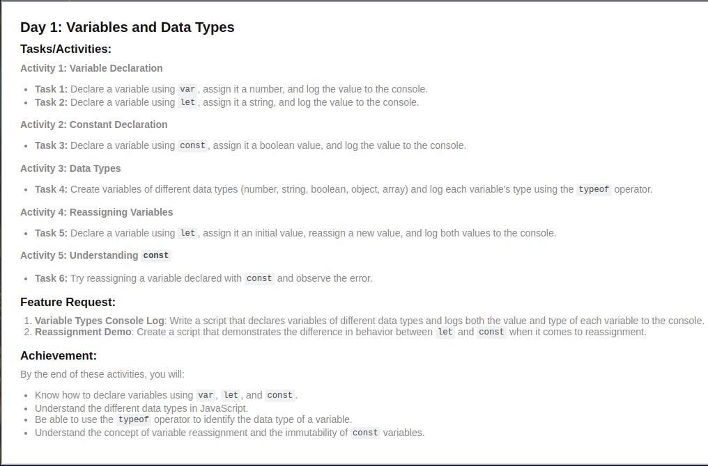
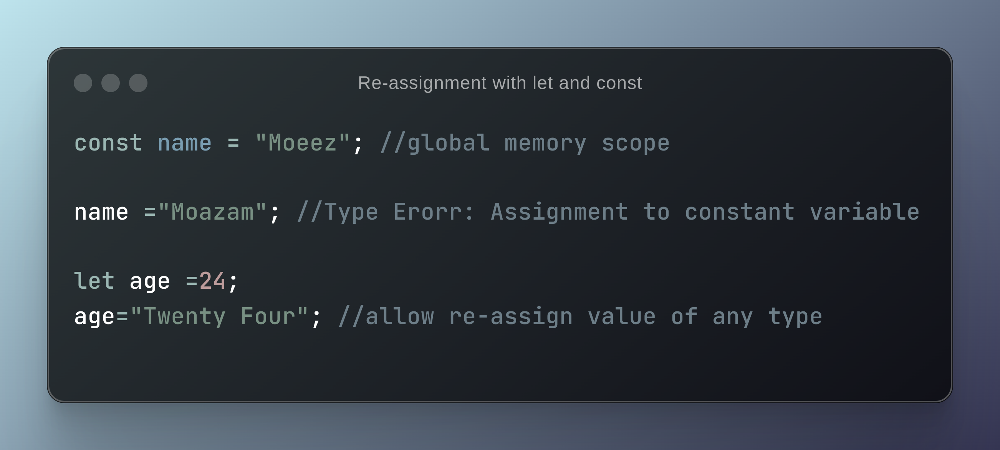

# Day 1: Variables and Data Types

## Tasks/Activities Outcome:

**Variables Declaration**:

Learn to Declare variable using var, let and const
- Javascript is a loosely typed language,you can assign any type value to initialize or re-declaration.
- variables declared with var keyword is in function scope and can be accessed throughout the funtion it is defined in. It can be accessed before defining/initialization.
- variable declarced with let and const keyword is in block(local) scope memory space and cannot access before initialization.They are in temporal dead zone. 

*Data Types in Javascript*: Premitive and non-premitive types.

- Premitive: undefined | string | null | number | boolean | bigInt | 
- Non-premitive (Object):  array | functions | objects 

## Feature Request:

1. **Variable Types Console Log**: Write a script that declares variables of different data types and logs both the value and type of each variable to the console.

    #### Typeof Array returns an Object 
    Arrays are a specific kind of object in JavaScript. This is because they have properties and methods, just like other objects in JavaScript.

    ***Why is an Array an Object?***: 

    1- Array Properties and Methods: Arrays in JavaScript have properties like length and methods like push, pop, map, filter, etc., which are characteristics of objects.
    

2. **Reassignment Demo**: Demonstrates the difference in behavior between `let` and `const` when it comes to reassignment.

  - Variables declared with const can not be reassigned value.
  - Variables declared with let can be reassigned.
  - cannot redeclared variable with same name within same scope.
  - Initialization of variable declared with let keyword is not required but variable with const keyword required initalization.

**Difference between 'var', 'const' and 'let'**:
- Hoisted:  
    1- All are hoisted to top of their scope. `var` is hoisted and assigned undefined value in code execution phase.

    2- `Let` and `const` are hoisted but cannot be accessed before the defining/initialization line in code so it gives `Reference Error`.
- Scope:

1- variables declared with `var` can be re-declared within same scope.

2- variables declared with `let` and `const` cannot be redeclared within same scope.

## Learning Outcome:

- variable declaration
- data types in javascript
- Scope
- Hoisting 
- Temporal deadzone
- Types of Error: when declaring variables with var, let and const
- Code Execution Phase
- global and block memory space concept

## Interview Questions:

JavaScript Basics:

- Explain the concept of hoisting in JavaScript.
  
   > Hoisting in JavaScript is a process to move declarations to top of their scope.

  *Brief Explaination*: In JavaScript, `var`,`let` and `const` are hoisted to top of their scope. Hoisting gives us ability to access the variables or functions even before defining/Initializing them.We can access variables before assigning any value to it and it does not give any error.if there is not variable that we are trying to access, it gives `Refernce Error :variable is not defined`.

  1. `Hositing with var keyword`: Variable with var keyword are hoisted and assign undefined value during code execution phase. so we can access them before defining/Initializing them.

  2. `Hositing with let and const keyword`: let and const declarations are also hoisted but we cannot access them before defining/initializing them.They are in temporal dead zone.
   
   >Temporal dead zone is determined as time between the declaring a variable and assigning a value to it.
   
   We got `Reference error:Cannot access before initialization`  when we try to access a variable in temporal dead zone.

- What is the difference between let, const, and var?
Already Explained above
